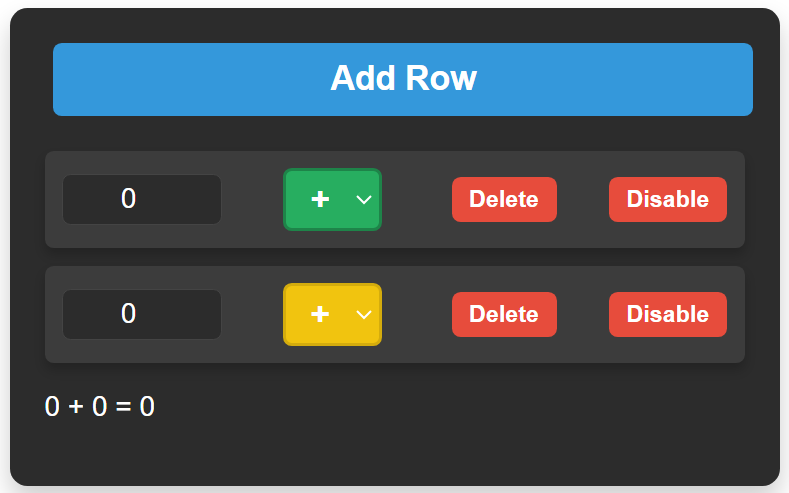

# Calcolatrice React - Documentazione Completa

## Commenti per CoolShop
- **Criticita riscontrate**: ci sono alcuni errori che si dovrebbero risolvere, putroppo per rispettare la consegna non potrò fare un analisi dettagliata ma cercherò di aggiuntare il bug di 'disable'.
- **Funzionni**: ho preferito usare funzioni 'primordiali' per lo sviluppo, sarebbero poi da migliorare con medoti come '.map', '.filter' e '.reduce'.
- **Documentazioni**: per problemi di tempo le documentazioni in jsDoc sono state generate tramite l'estensione di VsCode 'Mintify Doc Writer'.
- **Scelte**: ho scelto di usare jsx invece di tsx perchè non avendo anche affrontato React e Typescript ho preferito ducumentartmi su un argomento per volta.

## Funzionalità
1. **Aggiunta di righe**: Puoi aggiungere nuove righe per inserire numeri e operatori.
2. **Eliminazione di righe**: Puoi rimuovere righe esistenti per aggiornare il calcolo.
3. **Disabilitazione righe**: Puoi disabilitare/abilitare righe, escludendole dal calcolo.
4. **Selezione dell'operatore**: Ogni riga supporta l'assegnazione di un operatore aritmetico (`+`, `-`, `*`).
5. **Calcolo dinamico**: Il risultato viene calcolato in tempo reale sulla base delle righe attive e dei loro operatori.
6. **Interfaccia interattiva**: La UI mostra visivamente righe abilitate/disabilitate e differenzia l'ultima riga con un pulsante speciale.

---

## Requisiti
Prima di iniziare, assicurati di avere i seguenti strumenti installati:
- [Node.js](https://nodejs.org) (versione 14.x o successiva)
- [npm](https://www.npmjs.com/) o [yarn](https://yarnpkg.com/)

---

## Installazione
1. Clona il repository:
   ```bash
   git clone https://github.com/luca-picciotto/calculator-app-style.git
   cd calculator-app-style
   ```

2. Installa le dipendenze:
   ```bash
   npm install
   ```

3. Avvia l'applicazione:
   ```bash
   npm start
   ```

L'applicazione sarà accessibile su [http://localhost:3000](http://localhost:3000).


## Utilizzo

### Interfaccia Principale
- **Aggiungi riga**: Usa il pulsante `Add Row` per aggiungere una nuova riga.
- **Input numerico**: In ogni riga, inserisci un valore numerico nel campo input.
- **Selezione operatore**: Scegli un operatore aritmetico dal menu a tendina accanto al campo numerico.
- **Disabilitazione riga**: Usa il pulsante `Enable/Disable` per includere o escludere una riga dal calcolo.
- **Eliminazione riga**: Usa il pulsante `Delete` per rimuovere una riga.

### Pulsante `Select` speciale
- Il pulsante `Select` dell'ultima riga o dell'unica riga presente viene evidenziato in giallo, per indicare che è necessario aggiungere un'altra riga per proseguire.

---

## Logica di Calcolo
1. **Espressione mostrata**: La calcolatrice costruisce dinamicamente l'espressione matematica a partire dalle righe abilitate e la mostra sopra il risultato.
2. **Righe abilitate**: Solo le righe **non disabilitate** vengono incluse nel calcolo.
3. **Operazioni supportate**:
   - **Addizione (`+`)**
   - **Sottrazione (`-`)**
   - **Moltiplicazione (`*`)**

---

## Struttura del Progetto
Il progetto è diviso nei seguenti componenti principali:

### 1. **`App.js`**
Il cuore dell'applicazione gestisce:
- Stato delle righe, valori e operatori.
- Funzioni per aggiungere, rimuovere e disabilitare righe.
- Comunicazione tra i componenti.

### 2. **Componenti**
- **`AddButton`**: Pulsante per aggiungere una riga.
- **`LiElement`**: Rappresenta una riga con input, operatore e pulsanti di controllo.
- **`InputElement`**: Campo numerico per inserire valori.
- **`SelectOption`**: Menu a tendina per selezionare l'operatore.
- **`ButtonFunc`**: Pulsanti per eliminare/disabilitare righe.
- **`ResultComponent`**: Mostra l'espressione e il risultato del calcolo.

### 3. **Stili**
Gli stili sono definiti nel file `calculator.css`. La grafica include:
- Differenziazione visiva tra righe abilitate e disabilitate.
- Evidenziazione dell'ultima riga.
- Design simile a una calcolatrice reale.

---

## Esempio di Utilizzo
1. Aggiungi una riga e inserisci un valore numerico (ad esempio `5`).
2. Seleziona un operatore (ad esempio `+`).
3. Aggiungi un'altra riga e inserisci un altro valore (ad esempio `3`).
4. Continua aggiungendo righe e costruendo la tua espressione.
5. Il risultato verrà mostrato automaticamente.

---

## Screenshot

### Layout della Calcolatrice


---

## Manutenzione e Personalizzazione
1. Per modificare il comportamento o aggiungere nuove funzionalità, inizia da `App.js`.
2. Gli operatori possono essere estesi nel file `utils/mathFunctions.js`.
3. Stili personalizzati possono essere aggiunti in `calculator.css`.
